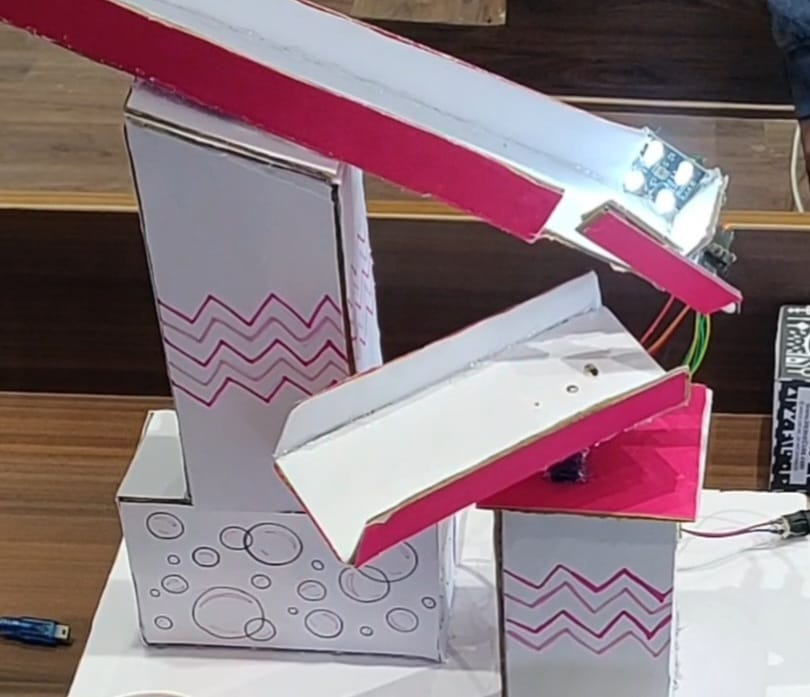

# Arduino Color Sorting Robot

## Overview

The Arduino Color Sorting Robot is an automated embedded system designed to detect, classify, and sort colored objects in real time. The project utilizes a **TCS3200 Color Sensor**, **Arduino Nano**, and **Servo Motors** to identify object colors and automatically direct them into the appropriate sorting compartments.

This project demonstrates the practical application of embedded systems, sensor integration, robotics, and industrial automation concepts through a low-cost and efficient color-based sorting mechanism.

---

## Project Showcase

### Hardware Prototype



### Demonstration Videos

🎥 **Setup Video:** See `Images/Setup.mp4`

🎥 **Working Demo:** See `Images/Demo.mp4`

---

## Project Objectives

* Detect colored objects using a color sensor.
* Classify objects based on RGB frequency values.
* Automate sorting using servo-controlled gates.
* Reduce manual intervention in object classification.
* Demonstrate real-time sensor-based decision making.

---

## Features

* Real-time color detection and classification.
* Automated sorting mechanism using servo motors.
* Arduino-based embedded control system.
* Compact and low-cost hardware design.
* Multiple color category support.
* Fast and reliable object segregation.

---

## Hardware Components

* Arduino Nano
* TCS3200 / TCS230 Color Sensor
* SG90 Servo Motors
* Breadboard
* Jumper Wires
* Power Supply
* Custom Sorting Mechanism

---

## Software Used

* Arduino IDE
* Embedded C/C++
* Servo Library

---

## Working Principle

1. Colored objects are introduced into the sorting mechanism.
2. The TCS3200 color sensor measures RGB frequency values.
3. Arduino Nano processes the sensor readings.
4. The detected color is classified using predefined thresholds.
5. Servo motors rotate to the corresponding position.
6. The object is directed into its designated compartment.

---

## System Architecture

```text
Object
   │
   ▼
TCS3200 Color Sensor
   │
   ▼
Arduino Nano
   │
   ▼
Color Classification Logic
   │
   ▼
Servo Motor Control
   │
   ▼
Sorting Bin
```

---

## Results

The developed system successfully:

* Identified colored objects in real time.
* Sorted objects into their respective compartments.
* Demonstrated reliable sensor-to-actuator communication.
* Reduced manual sorting effort through automation.
* Achieved consistent sorting performance during testing.

---

## Repository Structure

```text
Arduino-Color-Sorting-Robot/
│
├── README.md
│
├── Color-Sorter/
└── Code/
    └── color_sorter.ino
└── Report/
    └── Report.pdf
│
├── Images/
│   ├── Color-Sorter.jpeg
│   ├── Setup.mp4
│   └── Demo.mp4

```

---

## Documentation

The repository includes:

* **color_sorter.ino** – Arduino source code for color detection and sorting.
* **Color-Sorter.jpeg** – Final hardware prototype image.
* **Setup.mp4** – Hardware setup and assembly demonstration.
* **Demo.mp4** – Working demonstration of the sorting process.
* **Report.pdf** – Detailed project documentation, methodology, implementation, and results.

---

## Applications

* Industrial object sorting
* Manufacturing automation
* Packaging systems
* Recycling and waste segregation
* Smart warehouse operations
* Educational robotics projects

---

## Future Improvements

* Support for additional color categories.
* Conveyor belt integration.
* IoT-based monitoring and control.
* Mobile application integration.
* Machine learning-based color classification.
* High-speed industrial deployment.

---

## Author

**Kshiti Anil Kumar**

Computer Science Engineering Student

---

## License

This project is shared for educational and academic purposes.
